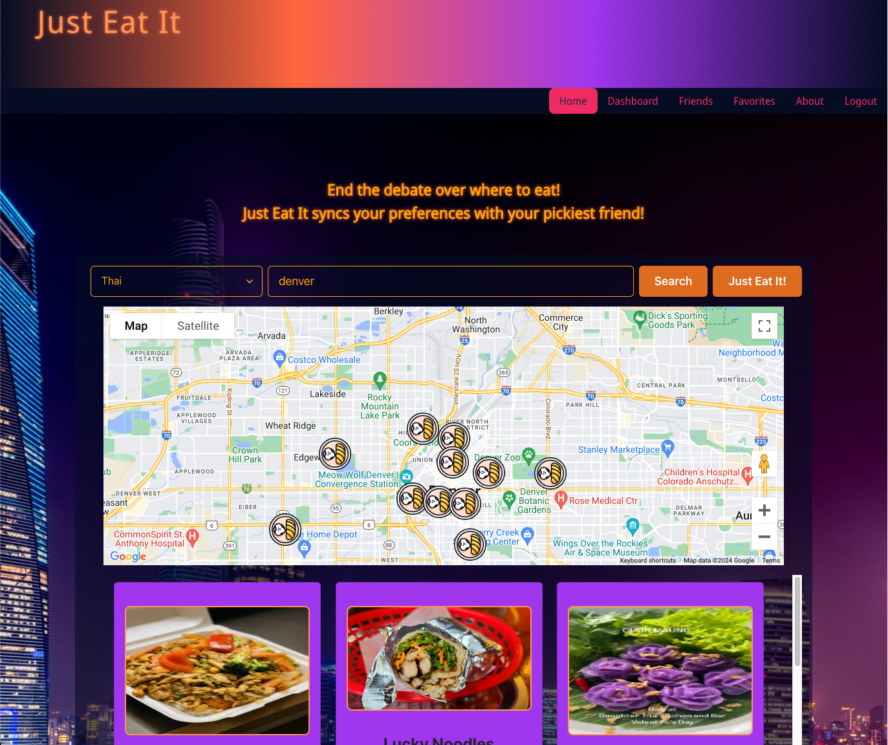
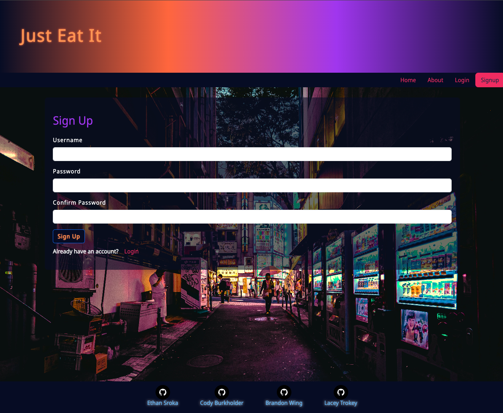
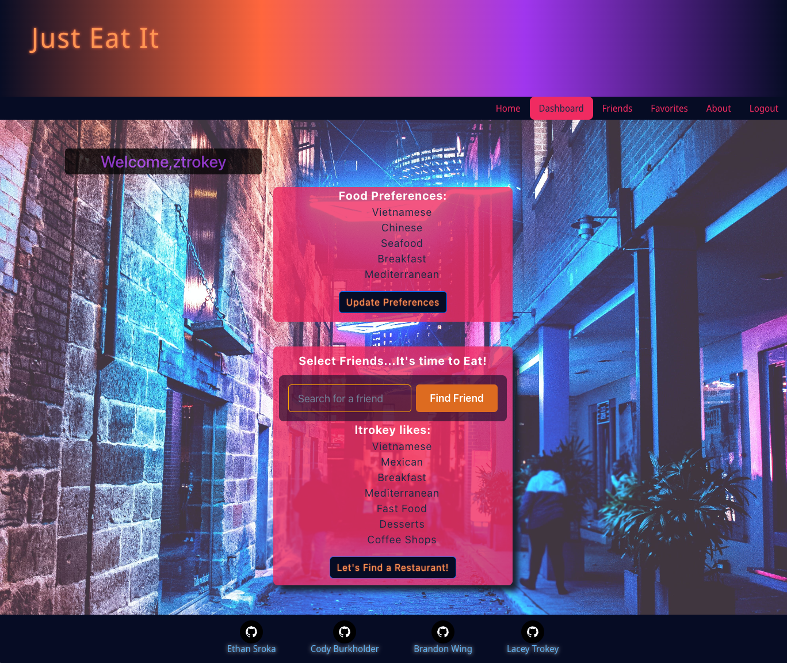
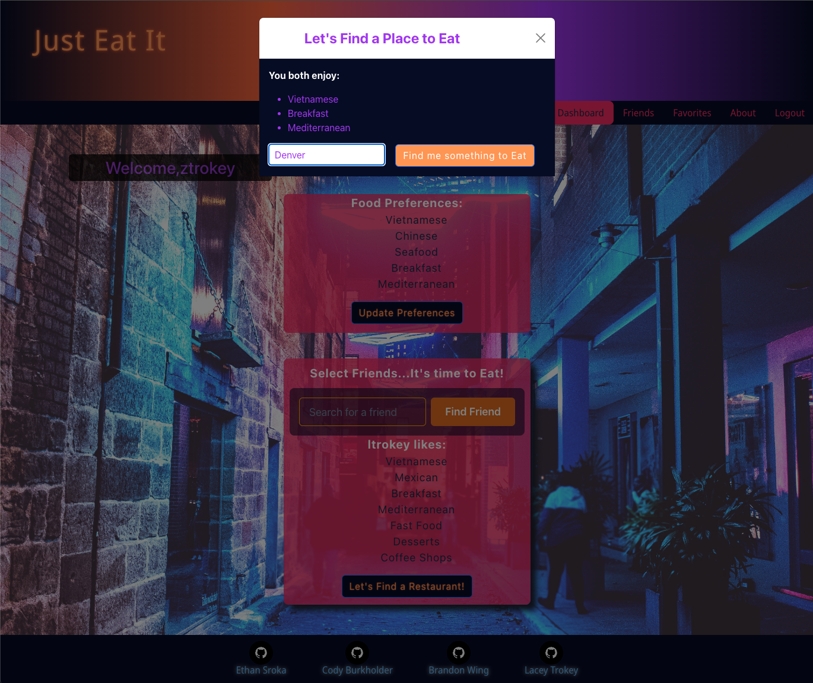
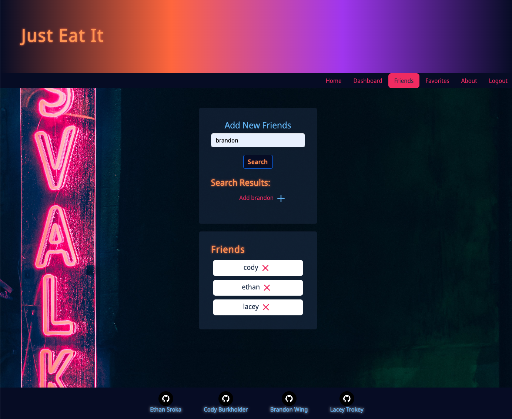
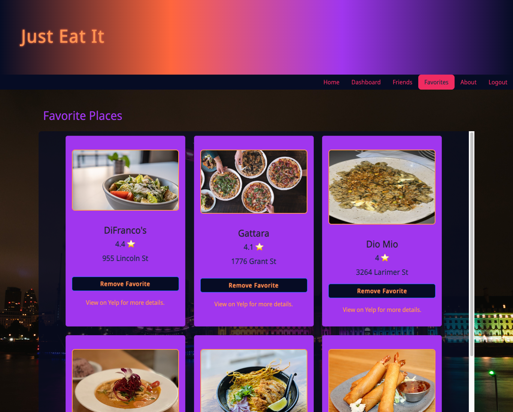

# Just Eat It

[](https://opensource.org/licenses/MIT)

[Link to live deploy](https://just-eat-it-test-a5e86dcbbf47.herokuapp.com/)

## Description

Just Eat It is a dynamic application built on the MERN (MongoDB, Express.js, React, Node.js) stack, tailored to streamline the restaurant selection process based on user and friend preferences. Designed for efficiency, the app enables registered users to specify their pickiest friend's food preferences, compares them with the user's own tastes, and locates a restaurant that aligns with both. This intuitive solution not only saves valuable time but also enhances the dining experience by combining random preference matches with user-input locations.

## Table of Contents

- [Installation](#installation)
- [Usage](#usage)
- [Badges](#badges)
- [Collaborators](#collaborators)
- [Features](#features)
- [Questions](#questions)

## Installation

1. **Clone the Repository**
   ```
   git clone https://github.com/ethancs13/final-project
   cd final-project
   ```
2. **Install Dependencies**

   ```
   npm i
   ```

3. **Seed Database**

   - Seed Initial Data (exit MySQL):

   ```
    npm run seed
   ```

4. **Set up Environment Variables**

   - Create a .env file in the server directory.
   - Add your MongoDB connection URI, Yelp API key, Google Maps API key, and any other necessary environment variables.

## Usage

1.  Run the Application

    - After following the installation instructions, execute the application by running the following command:

      ```
      npm run develop
      ```

2.  Home Page

    - Enter a location in the search bar and optionally select a food preference to discover a curated list of delicious restaurant choices.
    - Utilize the "Just Eat It" button for quick access to a single curated restaurant choice.
    - Features a map displaying the location and restaurant markers for easy navigation.

      

3.  Sign Up or Login

    - Begin your culinary journey by creating an account or logging in to access personalized features.
    - Utilize the home page to search restaurants and save your favorite places.

      

4.  Dashboard

    - Update your food preferences with a list of delectable options.
    - Use the "Select Friends... It's time to Eat!" search bar to input a location, add your friend to match food preferences, and find a place to eat!

      

      

5.  Friends

    - Search Just Eat It's user database to connect with friends and add those users to your friends.
    - Includes the option to remove friends from your network.
      <!-- - Engage in live chat with your friends for real-time communication. -->

      

6.  Favorites

    - Discover restaurants you love and save them for future reference using the "Favorite" button.
    - Easily remove any saved restaurants as desired.

      

## Badges


## Collaborators

- [Cody Burkholder](https://github.com/chilejay7)
- [Ethan Sroka](https://github.com/ethancs13)
- [Lacey Trokey](https://github.com/ltrokey)

## Features

**MongoDB**

- Database Management: Utilized MongoDB for efficient storage and retrieval of user data, restaurant details, and more.
- Data Modeling: Implemented MongoDB's flexible schema to structure data according to application requirements.

**Express.js**

- Server-side Routing: Used Express.js to define routes for handling HTTP requests and responses.
- Middleware Integration: Integrated Express middleware for tasks such as request parsing, authentication, and error handling.

**Node.js**

- Server Environment: Utilized Node.js to create a robust server environment capable of handling concurrent requests.
- Asynchronous Programming: Leveraged Node.js's event-driven architecture for efficient handling of I/O operations.

**React**

- Dynamic User Interface: Built interactive and dynamic user interfaces with React for seamless user experiences.
- Component-based Architecture: Developed reusable UI components to encapsulate behavior and facilitate code maintenance.

**JavaScript**

- Core Language: Leveraged JavaScript for client-side and server-side development to create cohesive web applications.
- ES6+ Features: Utilized modern JavaScript features such as arrow functions, destructuring, and async/await for cleaner and more concise code.

**Vite**

- Development Server: Used Vite for fast and efficient development with features like hot module replacement and optimized build times.
- Modern Build Tooling: Leveraged Vite's support for modern JavaScript features, CSS preprocessing, and dependency resolution.

**GraphQL**

- Efficient Data Fetching: Utilized GraphQL to fetch data efficiently by allowing clients to request only the data they need.
- Schema Definition: Defined a GraphQL schema to describe the application's data model and operations.
  Apollo
- Client-side Data Management: Managed application state and data fetching with Apollo Client for seamless integration with GraphQL APIs.
- Server-side GraphQL Integration: Used Apollo Server to build a GraphQL server that connects to the application's data sources.

**Google Maps API**

- Location-based Services: Integrated Google Maps API to display maps, geocode addresses, and provide location-based services for restaurant search and visualization.

**Yelp Fusion API**

- Restaurant Data: Accessed restaurant data from the Yelp Fusion API for comprehensive information including ratings, reviews, and photos.
- Search Capabilities: Utilized Yelp API's search capabilities to retrieve restaurant recommendations based on location and cuisine preferences.

**Express Middleware**

- Custom Middleware: Implemented custom middleware functions in Express for tasks such as authentication, logging, and request processing.
- Error Handling: Used middleware for centralized error handling to improve application robustness and maintainability.

**JWT (JSON Web Tokens)**

- Secure Authentication: Implemented JWT-based authentication to securely authenticate users and authorize access to protected routes.
- Stateless Authentication: Used JWT tokens for stateless authentication, eliminating the need for server-side session management.

**MVC Architecture**

- Modular Organization: Adopted the MVC (Model-View-Controller) architecture for separating concerns and organizing application logic into distinct modules.
- Scalability and Maintainability: Benefited from MVC's modular structure for scalability, maintainability, and code reusability.

**Bootstrap**

- Responsive Design: Utilized Bootstrap's grid system and components to create responsive and mobile-friendly user interfaces.
- UI Components: Leveraged Bootstrap's pre-styled components for consistent and visually appealing UI elements.

**Chakra UI**

- Customizable Design: Create custom UI components and styles with Chakra UI's theming and styling capabilities.
- Accessibility Features: Benefit from Chakra UI's built-in accessibility features for creating accessible web applications.

**React Router DOM**

- Client-side Routing: Implement client-side routing with React Router DOM for navigation and managing application state based on URL changes.
- Route Configuration: Define route configuration to map URLs to React components and enable navigation between different views.

## Questions

Please feel free to follow me on GitHub.

[Brandon Wing](https://github.com/Bwing2)
